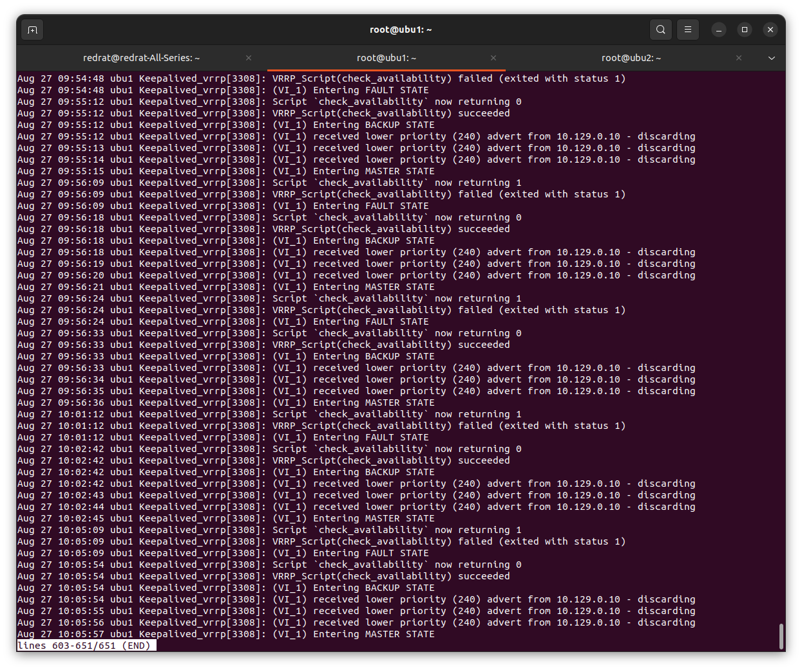

# Домашнее задание к занятию "Disaster Recovery. FHRP и Keepalived" - Пешева Ирина


### Задание 1
- Дана схема для Cisco Packet Tracer, рассматриваемая в лекции.
- На данной схеме уже настроено отслеживание интерфейсов маршрутизаторов Gi0/1 (для нулевой группы)
- Необходимо аналогично настроить отслеживание состояния интерфейсов Gi0/0 (для первой группы).
- Для проверки корректности настройки, разорвите один из кабелей между одним из маршрутизаторов и Switch0 и запустите ping между PC0 и Server0.
- На проверку отправьте получившуюся схему в формате pkt и скриншот, где виден процесс настройки маршрутизатора.
### Решение 1


---
### Задание 2
- Запустите две виртуальные машины Linux, установите и настройте сервис Keepalived как в лекции, используя пример конфигурационного файла.
- Настройте любой веб-сервер (например, nginx или simple python server) на двух виртуальных машинах
- Напишите Bash-скрипт, который будет проверять доступность порта данного веб-сервера и существование файла index.html в root-директории данного веб-сервера.
- Настройте Keepalived так, чтобы он запускал данный скрипт каждые 3 секунды и переносил виртуальный IP на другой сервер, если bash-скрипт завершался с кодом, отличным от нуля (то есть порт веб-сервера был недоступен или отсутствовал index.html). Используйте для этого секцию vrrp_script
- На проверку отправьте получившейся bash-скрипт и конфигурационный файл keepalived, а также скриншот с демонстрацией переезда плавающего ip на другой сервер в случае недоступности порта или файла index.html
### Решение 2

#### Настройка keepalived

Созданы две вирутальные машины с внутренними адресами 10.129.0.28/24 и 10.129.0.10/24 соответственно.

Сервис keepalived установлен на обе ВМ, добавлен в автозагрузку и запущен. 

В обоих добавлен файл /etc/keepalived/keepalived.conf. Содержимое файлов на ВМ
```
vrrp_instance VI_1 {
        state MASTER
        interface eth0
        virtual_router_id 15
        priority 255
        advert_int 1

        virtual_ipaddress {
              10.129.0.15/24
        }
	
	  unicast_peer {
		  10.129.0.10   # BACKUP_IP_VALUE
	  }
}
```
и
```
vrrp_instance VI_2 {
        state BACKUP
        interface eth0
        virtual_router_id 15
        priority 240
        advert_int 1

        virtual_ipaddress {
              10.129.0.15/24
        }
	  unicast_peer {
		  10.129.0.28   # MASTER_IP_VALUE 
	  }
}
```
соответственно.

#### Настройка nginx

Устанавливаем nginx -- вот, в общем-то, и вся настройка.


#### Создание bash-скрипта

Bash-скрипт /usr/local/bin/check_server_availability.sh будет возвращать 1, если порт 80 недоступен, 2, если в root-директории нет файла index.html и 0, если таких проблем нет.

```bash
#!/bin/bash

host=localhost
port=80
file_path=/index.html


nc -z $host $port

port_is_open=$?

if [[ port_is_open -eq 0 && -f "$file_path" ]]; then
    exit 0
else
    exit 1
fi
```

Проверяем на одной из машин:


Работает.

#### Настройка запуска скрипта в keepalived

Модифицируем файл /etc/keepalived/keepalived.conf:

```
vrrp_script check_availability {
	script "/usr/local/bin/check_server_availability.sh"
	interval 3
}

vrrp_instance VI_1 {
        state MASTER
        interface eth0
        virtual_router_id 15
        priority 255
        advert_int 1

        virtual_ipaddress {
              10.129.0.15/24
        }

	track_script {
		check_availability
	}
	
	unicast_peer {
		10.129.0.10   # BACKUP_IP_VALUE
	}
}
```

Проверяем. Роняем nginx, затем восстанавливаем:


Ip 127.10.0.15 "переехал" на вторую ВМ, затем вернулся на первую:


Удаляем и восстанавливаем файл:


Картина та же.

В логах можно увидеть переключения статусов машин:




---

## Дополнительные задания (со звездочкой*)

Эти задания дополнительные (не обязательные к выполнению) и никак не повлияют на получение вами зачета по этому домашнему заданию. Вы можете их выполнить, если хотите глубже и/или шире разобраться в материале.

### Задание 3
- Изучите дополнительно возможность Keepalived, которая называется vrrp_track_file
- Напишите bash-скрипт, который будет менять приоритет внутри файла в зависимости от нагрузки на виртуальную машину (можно разместить данный скрипт в cron и запускать каждую минуту). Рассчитывать приоритет можно, например, на основании Load average.
- Настройте Keepalived на отслеживание данного файла.
- Нагрузите одну из виртуальных машин, которая находится в состоянии MASTER и имеет активный виртуальный IP, и проверьте, чтобы через некоторое время она перешла в состояние SLAVE из-за высокой нагрузки и виртуальный IP переехал на другой, менее нагруженный сервер.
- Попробуйте выполнить настройку keepalived на третьем сервере и скорректировать при необходимости формулу так, чтобы плавающий ip адрес всегда был прикреплен к серверу, имеющему наименьшую нагрузку.
- На проверку отправьте получившийся bash-скрипт и конфигурационный файл keepalived, а также скриншоты логов keepalived с серверов при разных нагрузках
### Решение 3


