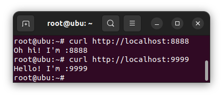
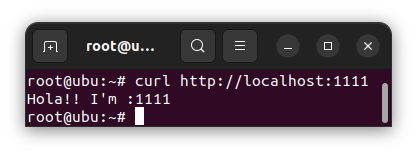
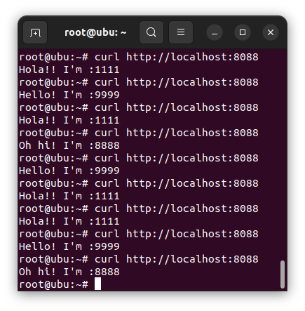
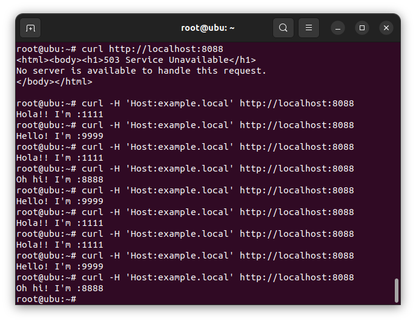

# Домашнее задание к занятию "Кластеризация и балансировка нагрузки" - Пешева Ирина


### Задание 1
- Запустите два simple python сервера на своей виртуальной машине на разных портах.
- Установите и настройте HAProxy, воспользуйтесь материалами к лекции по ссылке.
- Настройте балансировку Round-robin на 4 уровне.
- На проверку направьте конфигурационный файл haproxy, скриншоты, где видно перенаправление запросов на разные серверы при обращении к HAProxy.

### Решение 1

#### Запуск python серверов

Создаём файл ~/http1/index.html и запускаем server:

```
python3 -m http.server 8888 --bind 0.0.0.0
```
Аналогично запускаем второй сервер, но с другим содержимым файла и на другом порту.

Проверяем curl'ом:



#### Настройка HAProxy

В файле /etc/haproxy/haproxy.cfg добавляем секции listen, frontend и backend:

```
listen stats  # веб-страница со статистикой
        bind                    :888
        mode                    http
        stats                   enable
        stats uri               /stats
        stats refresh           5s
        stats realm             Haproxy\ Statistics

frontend example  # секция фронтенд
        mode http
        bind :8088
        default_backend web_servers

backend web_servers    # секция бэкенд
        mode http
        balance roundrobin
        option httpchk
        http-check send meth GET uri /index.html
        server s1 127.0.0.1:8888 check
        server s2 127.0.0.1:9999 check

```

Пока что балансировка происходит на 7 уровне.

#### Добавление баланисровки на 4 уровне

В файл /etc/haproxy/haproxy.cfg добавляем секцию listen:

```
listen web_tcp

	bind :1325

	server s1 127.0.0.1:8888 check inter 3s
	server s2 127.0.0.1:9999 check inter 3s
```

Теперь при обращении к порту 1325 происходит балансировка на 4 уровне:


---
### Задание 2
- Запустите три simple python сервера на своей виртуальной машине на разных портах
- Настройте балансировку Weighted Round Robin на 7 уровне, чтобы первый сервер имел вес 2, второй - 3, а третий - 4
- HAproxy должен балансировать только тот http-трафик, который адресован домену example.local
- На проверку направьте конфигурационный файл haproxy, скриншоты, где видно перенаправление запросов на разные серверы при обращении к HAProxy c использованием домена example.local и без него.

### Решение 2

#### Запуск третьего python сервера

В дополнение к портам 8888 и 9999 появился 1111:



#### Настройка Weighted Round Robin на 7 уровне

В секции backend web_servers  назначим веса в /etc/haproxy/haproxy.cfg, а заодно добавим новый сервер:

```
backend web_servers    # секция бэкенд
        mode http
        balance roundrobin
        option httpchk
        http-check send meth GET uri /index.html
        server s1 127.0.0.1:8888 weight 2 check
        server s2 127.0.0.1:9999 weight 3 check
	    server s3 127.0.0.1:1111 weight 4 check
```



2 запроса ушло на s1, 3 на s2 и 4 на s3, как и планировалось.

#### Настройка трафика

В /etc/haproxy/haproxy.cfg в секции frontend example добавляем ACL с именем ACL_example.local для ограничения трафика:

```
frontend example  # секция фронтенд
        mode http
        bind :8088
	    acl ACL_example.local hdr(host) -i example.local
	    use_backend web_servers if ACL_example.local
```

Балансируется только трафик, направленный на example.local:



---

## Дополнительные задания (со звездочкой*)

Эти задания дополнительные (не обязательные к выполнению) и никак не повлияют на получение вами зачета по этому домашнему заданию. Вы можете их выполнить, если хотите глубже и/или шире разобраться в материале.

### Задание 3
- Настройте связку HAProxy + Nginx как было показано на лекции.
- Настройте Nginx так, чтобы файлы .jpg выдавались самим Nginx (предварительно разместите несколько тестовых картинок в директории /var/www/), а остальные запросы переадресовывались на HAProxy, который в свою очередь переадресовывал их на два Simple Python server.
- На проверку направьте конфигурационные файлы nginx, HAProxy, скриншоты с запросами jpg картинок и других файлов на Simple Python Server, демонстрирующие корректную настройку.

### Решение 3

---

### Задание 4
- Запустите 4 simple python сервера на разных портах.
- Первые два сервера будут выдавать страницу index.html вашего сайта example1.local (в файле index.html напишите example1.local)
- Вторые два сервера будут выдавать страницу index.html вашего сайта example2.local (в файле index.html напишите example2.local)
- Настройте два бэкенда HAProxy
- Настройте фронтенд HAProxy так, чтобы в зависимости от запрашиваемого сайта example1.local или example2.local запросы перенаправлялись на разные бэкенды HAProxy
- На проверку направьте конфигурационный файл HAProxy, скриншоты, демонстрирующие запросы к разным фронтендам и ответам от разных бэкендов.

### Решение 4


