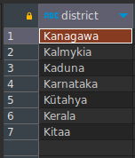
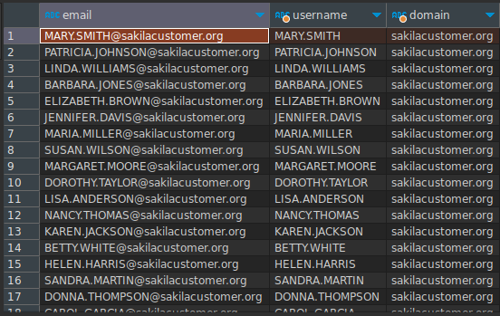
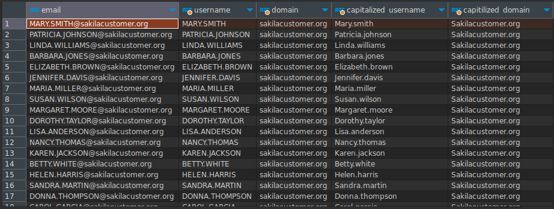

# Домашнее задание к занятию "SQL. Часть 1" - Пешева Ирина


### Задание 1

Получите уникальные названия районов из таблицы с адресами, которые начинаются на “K” и заканчиваются на “a” и не содержат пробелов.

### Решение 1

```sql
SELECT
	DISTINCT district
FROM
	address
WHERE
	LEFT(district, 1) = 'K'
	AND RIGHT(district, 1) = 'a'
	AND POSITION(" " IN district) = 0;
```



---
### Задание 2

Получите из таблицы платежей за прокат фильмов информацию по платежам, которые выполнялись в промежуток с 15 июня 2005 года по 18 июня 2005 года **включительно** и стоимость которых превышает 10.00.

### Решение 2

```sql
SELECT
	*
FROM
	payment
WHERE
	amount > 10
	AND payment_date > '2005-06-15'
	AND payment_date < '2005-06-19';
```


---
### Задание 3

Получите последние пять аренд фильмов.

### Решение 3

```sql
SELECT
	*
FROM
	rental
ORDER BY
	rental_date DESC
LIMIT 5;
```


---

### Задание 4

Одним запросом получите активных покупателей, имена которых Kelly или Willie. 

Сформируйте вывод в результат таким образом:
- все буквы в фамилии и имени из верхнего регистра переведите в нижний регистр,
- замените буквы 'll' в именах на 'pp'.


### Решение 4

```sql
SELECT
	customer_id,
	store_id,
	REPLACE(LOWER(first_name), 'll', 'pp') AS first_name,
	LOWER(last_name) AS last_name,
	email,
	address_id,
	active,
	create_date,
	last_update
FROM
	customer
WHERE
	active = 1
	AND first_name IN ('Kelly', 'Willie');
```


---

## Дополнительные задания (со звездочкой*)

Эти задания дополнительные (не обязательные к выполнению) и никак не повлияют на получение вами зачета по этому домашнему заданию. Вы можете их выполнить, если хотите глубже и/или шире разобраться в материале.

### Задание 5

Выведите Email каждого покупателя, разделив значение Email на две отдельных колонки: в первой колонке должно быть значение, указанное до @, во второй — значение, указанное после @.

### Решение 5

```sql
SELECT
	email,
	SUBSTRING_INDEX(email, '@', 1) as username,
	SUBSTRING_INDEX(email, '@', -1) as 'domain'
FROM
	customer;
```



---

### Задание 6

Доработайте запрос из предыдущего задания, скорректируйте значения в новых колонках: первая буква должна быть заглавной, остальные — строчными.

### Решение 6

```sql
SELECT
	email,
	SUBSTRING_INDEX(email, '@', 1) as username,
	SUBSTRING_INDEX(email, '@', -1) as 'domain',
	CONCAT(
		UPPER(LEFT(SUBSTRING_INDEX(email, '@', 1), 1)), 
		LOWER(RIGHT(SUBSTRING_INDEX(email, '@', 1), 
				CHAR_LENGTH(SUBSTRING_INDEX(email, '@', 1)) - 1)
		)
	) AS capitalized_username,
	CONCAT(
		UPPER(LEFT(SUBSTRING_INDEX(email, '@', -1), 1)), 
		LOWER(RIGHT(SUBSTRING_INDEX(email, '@', -1), 
				CHAR_LENGTH(SUBSTRING_INDEX(email, '@', -1)) - 1)
		)
	) AS capitilized_domain
FROM
	customer;
```



---