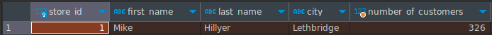
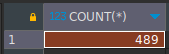
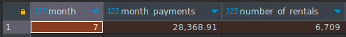
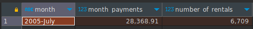
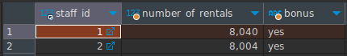
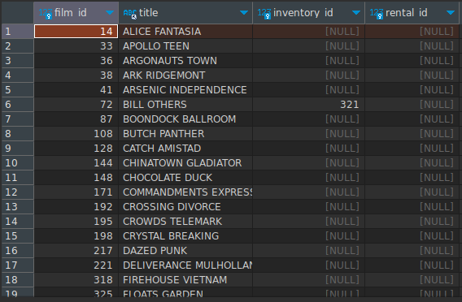

# Домашнее задание к занятию "" - Пешева Ирина


### Задание 1

Одним запросом получите информацию о магазине, в котором обслуживается более 300 покупателей, и выведите в результат следующую информацию: 
- фамилия и имя сотрудника из этого магазина;
- город нахождения магазина;
- количество пользователей, закреплённых в этом магазине.

### Решение 1

```sql
SELECT
	s.store_id,
	st.first_name,
	st.last_name,
	ct.city,
	cn.number_of_customers
FROM
	store s
INNER JOIN
	staff st
ON
	s.store_id = st.store_id
INNER JOIN 
	address a
ON
	s.address_id = a.address_id
INNER JOIN
	city ct
ON
	a.city_id = ct.city_id
INNER JOIN
	(
	SELECT
		store_id,
		COUNT(*) AS number_of_customers
	FROM
		customer c
	GROUP BY
		store_id) AS cn
ON
	s.store_id = cn.store_id
WHERE
	number_of_customers > 300;
```



---
### Задание 2

Получите количество фильмов, продолжительность которых больше средней продолжительности всех фильмов.

### Решение 2

```sql
SELECT
	COUNT(*)
FROM
	film f
WHERE
	length > (
	SELECT
		AVG(`length`)
	FROM
		film);
```



---
### Задание 3

Получите информацию, за какой месяц была получена наибольшая сумма платежей, и добавьте информацию по количеству аренд за этот месяц.

### Решение 3

Предположим, что имеется в виду месяц любого года.

```sql
SELECT
	mp.month,
	mp.month_payments,
	mr.number_of_rentals
FROM
	(
	SELECT
		SUM(amount) AS month_payments,
		MONTH(payment_date) AS `month`
	FROM
		payment p
	GROUP BY
		MONTH(payment_date)
) AS mp
INNER JOIN 
(
	SELECT
		COUNT(*) AS number_of_rentals,
		MONTH(rental_date) AS `month`
	FROM
		rental r
	GROUP BY
		MONTH(rental_date)
) as mr
ON
	mp.month = mr.month
ORDER BY
	mp.month_payments DESC
LIMIT 1
;
```



Теперь предположим, что год важен. Тогда:

```sql
SELECT
	mp.month,
	mp.month_payments,
	mr.number_of_rentals
FROM
	(
	SELECT
		SUM(amount) AS month_payments,
		DATE_FORMAT(payment_date, '%Y-%M') AS `month`
	FROM
		payment p
	GROUP BY
		DATE_FORMAT(payment_date, '%Y-%M')
) AS mp
INNER JOIN 
(
	SELECT
		COUNT(*) AS number_of_rentals,
		DATE_FORMAT(rental_date, '%Y-%M') AS `month`
	FROM
		rental r
	GROUP BY
		DATE_FORMAT(rental_date, '%Y-%M')
) as mr
ON
	mp.month = mr.month
ORDER BY
	mp.month_payments DESC
LIMIT 1
;
```



---

## Дополнительные задания (со звездочкой*)

Эти задания дополнительные (не обязательные к выполнению) и никак не повлияют на получение вами зачета по этому домашнему заданию. Вы можете их выполнить, если хотите глубже и/или шире разобраться в материале.

### Задание 4

Посчитайте количество продаж, выполненных каждым продавцом. Добавьте вычисляемую колонку «Премия». Если количество продаж превышает 8000, то значение в колонке будет «Да», иначе должно быть значение «Нет».

### Решение 4

```sql
SELECT
	staff_id,
	COUNT(*) number_of_rentals,
	CASE
		WHEN COUNT(*) > 8000 THEN "yes"
		ELSE "no"
	END AS bonus
FROM
	rental r
GROUP BY
	staff_id;
```



---
### Задание 5

Найдите фильмы, которые ни разу не брали в аренду.

### Решение 5

```sql
SELECT
	f.film_id,
	f.title,
	i.inventory_id,
	r.rental_id
FROM
	film f
LEFT JOIN inventory i 
ON
	f.film_id = i.film_id
LEFT JOIN rental r
ON
	i.inventory_id = r.rental_id
WHERE
	r.rental_id IS NULL;
```

Как оказалось, часть фильмов даже и не выставляли в аренду.


