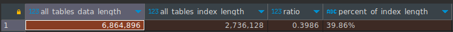

# Домашнее задание к занятию "Индексы" - Пешева Ирина


### Задание 1

Напишите запрос к учебной базе данных, который вернёт процентное отношение общего размера всех индексов к общему размеру всех таблиц.

### Решение 1

Для наглядности выведем не только итоговое значение, но и промежуточные значения. Тогда:

```sql
SELECT
	SUM(DATA_LENGTH) as all_tables_data_length,
	SUM(INDEX_LENGTH) AS all_tables_index_length,
	SUM(INDEX_LENGTH)/SUM(DATA_LENGTH) AS ratio,
	CONCAT(ROUND(SUM(INDEX_LENGTH)/SUM(DATA_LENGTH) * 100, 2), "%") AS percent_of_index_length
FROM
	INFORMATION_SCHEMA.TABLES;
```



---
### Задание 2

Выполните explain analyze следующего запроса:
```sql
select distinct concat(c.last_name, ' ', c.first_name), sum(p.amount) over (partition by c.customer_id, f.title)
from payment p, rental r, customer c, inventory i, film f
where date(p.payment_date) = '2005-07-30' and p.payment_date = r.rental_date and r.customer_id = c.customer_id and i.inventory_id = r.inventory_id
```
- перечислите узкие места;
- оптимизируйте запрос: внесите корректировки по использованию операторов, при необходимости добавьте индексы.


### Решение 2

Результат EXPLAIN ANALYZE следующий:

```
-> Limit: 200 row(s)  (cost=0..0 rows=0) (actual time=6144..6144 rows=200 loops=1)
    -> Table scan on <temporary>  (cost=2.5..2.5 rows=0) (actual time=6144..6144 rows=200 loops=1)
        -> Temporary table with deduplication  (cost=0..0 rows=0) (actual time=6144..6144 rows=391 loops=1)
            -> Window aggregate with buffering: sum(payment.amount) OVER (PARTITION BY c.customer_id,f.title )   (actual time=2515..5937 rows=642000 loops=1)
                -> Sort: c.customer_id, f.title  (actual time=2515..2579 rows=642000 loops=1)
                    -> Stream results  (cost=21.1e+6 rows=15.4e+6) (actual time=0.404..1863 rows=642000 loops=1)
                        -> Nested loop inner join  (cost=21.1e+6 rows=15.4e+6) (actual time=0.398..1607 rows=642000 loops=1)
                            -> Nested loop inner join  (cost=19.5e+6 rows=15.4e+6) (actual time=0.393..1408 rows=642000 loops=1)
                                -> Nested loop inner join  (cost=18e+6 rows=15.4e+6) (actual time=0.386..1215 rows=642000 loops=1)
                                    -> Inner hash join (no condition)  (cost=1.54e+6 rows=15.4e+6) (actual time=0.371..54 rows=634000 loops=1)
                                        -> Filter: (cast(p.payment_date as date) = '2005-07-30')  (cost=1.61 rows=15400) (actual time=0.0323..6.75 rows=634 loops=1)
                                            -> Table scan on p  (cost=1.61 rows=15400) (actual time=0.0213..4.92 rows=16044 loops=1)
                                        -> Hash
                                            -> Covering index scan on f using idx_title  (cost=112 rows=1000) (actual time=0.0708..0.255 rows=1000 loops=1)
                                    -> Covering index lookup on r using rental_date (rental_date=p.payment_date)  (cost=0.969 rows=1) (actual time=0.00118..0.00168 rows=1.01 loops=634000)
                                -> Single-row index lookup on c using PRIMARY (customer_id=r.customer_id)  (cost=250e-6 rows=1) (actual time=125e-6..151e-6 rows=1 loops=642000)
                            -> Single-row covering index lookup on i using PRIMARY (inventory_id=r.inventory_id)  (cost=250e-6 rows=1) (actual time=114e-6..140e-6 rows=1 loops=642000)
```

Рука тянется убрать лишние таблицы, но данные говорят, что не в них пробелема. Во всяком случае, не в основном:
* Наибольший прирост времени приносит оконная функция, суммирующая платежи p.amount, группируя их по (почему-то) r.customer_id и f.title
* При этом значительную часть времени составляет сортировка по этим двум столбцам.
* Впрочем, inner join таблиц тоже занимает немало.

Ну, будем избавляться.
* Самое затратное действие – группировка по c.customer_id и f.title. Во-первых, непонятно, зачем здесь вообще film. Её можно убрать из условия без потери результата.
Во-вторых, таблица film у нас беспорядочно присоединена ко всем записям (условий-то для присоединения нет), что порождает их бессчётное количество. Шутка ли, каждая запись дублируется 1000 раз.
В выводе film нигде не фигурирует и как будто не служит построению транзитивной связи, так что её можно с чистой совестью удалить.

Это уже приносит значетельный прирост производительности – на два порядка:
```
-> Limit: 200 row(s)  (cost=0..0 rows=0) (actual time=17.1..17.1 rows=200 loops=1)
    -> Table scan on <temporary>  (cost=2.5..2.5 rows=0) (actual time=17.1..17.1 rows=200 loops=1)
        -> Temporary table with deduplication  (cost=0..0 rows=0) (actual time=17.1..17.1 rows=391 loops=1)
            -> Window aggregate with buffering: sum(payment.amount) OVER (PARTITION BY c.customer_id )   (actual time=15.8..16.8 rows=642 loops=1)
                -> Sort: c.customer_id  (actual time=15.8..15.8 rows=642 loops=1)
                    -> Stream results  (cost=17751 rows=15420) (actual time=0.132..15.5 rows=642 loops=1)
                        -> Nested loop inner join  (cost=17751 rows=15420) (actual time=0.126..15.2 rows=642 loops=1)
                            -> Nested loop inner join  (cost=12353 rows=15420) (actual time=0.12..14 rows=642 loops=1)
                                -> Nested loop inner join  (cost=6956 rows=15420) (actual time=0.112..13 rows=642 loops=1)
                                    -> Filter: (cast(p.payment_date as date) = '2005-07-30')  (cost=1564 rows=15400) (actual time=0.0899..11 rows=634 loops=1)
                                        -> Table scan on p  (cost=1564 rows=15400) (actual time=0.0709..8.61 rows=16044 loops=1)
                                    -> Covering index lookup on r using rental_date (rental_date=p.payment_date)  (cost=0.25 rows=1) (actual time=0.00218..0.00301 rows=1.01 loops=634)
                                -> Single-row index lookup on c using PRIMARY (customer_id=r.customer_id)  (cost=0.25 rows=1) (actual time=0.00118..0.00122 rows=1 loops=642)
                            -> Single-row covering index lookup on i using PRIMARY (inventory_id=r.inventory_id)  (cost=0.25 rows=1) (actual time=0.00156..0.0016 rows=1 loops=642)
```

* Тем не менее, есть куда стремиться. Например, в выводе не используются таблицы inventory и rental.
    * Тут, впрочем, возникает интересное дело. Таблицы customer и payment в исходном запросе не объединены напрямую. Customer и rental объединены через customer_id, а rental и payment объединены через payment_date и rental_date.<br>Казалось бы, payment содержит customer_id, можно объединить по нему. Вот только *дата оплаты* и *дата аренды* не зависят друг от друга. Да, они в основном совпадают, но есть отличие **буквально в одном месте**, в записи с rental_id = 1301. В ней почему-то обнулено время rental_date. <br> 
    Только это обстоятельство не позволяет удалить промежуточную таблицу rental.
    В идеале бы пойти и согласовать объединение по customer_id, но уж что имеем.

В общем, rental приходится оставить, а вот от inventory избавились.

```
-> Limit: 200 row(s)  (cost=0..0 rows=0) (actual time=8.57..8.61 rows=200 loops=1)
    -> Table scan on <temporary>  (cost=2.5..2.5 rows=0) (actual time=8.57..8.59 rows=200 loops=1)
        -> Temporary table with deduplication  (cost=0..0 rows=0) (actual time=8.57..8.57 rows=391 loops=1)
            -> Window aggregate with buffering: sum(payment.amount) OVER (PARTITION BY c.customer_id )   (actual time=7.57..8.4 rows=642 loops=1)
                -> Sort: c.customer_id  (actual time=7.54..7.57 rows=642 loops=1)
                    -> Stream results  (cost=12353 rows=15420) (actual time=0.086..7.37 rows=642 loops=1)
                        -> Nested loop inner join  (cost=12353 rows=15420) (actual time=0.0806..7.16 rows=642 loops=1)
                            -> Nested loop inner join  (cost=6956 rows=15420) (actual time=0.0727..6.58 rows=642 loops=1)
                                -> Filter: (cast(p.payment_date as date) = '2005-07-30')  (cost=1564 rows=15400) (actual time=0.0541..5.31 rows=634 loops=1)
                                    -> Table scan on p  (cost=1564 rows=15400) (actual time=0.0427..4.03 rows=16044 loops=1)
                                -> Covering index lookup on r using rental_date (rental_date=p.payment_date)  (cost=0.25 rows=1) (actual time=0.00137..0.00185 rows=1.01 loops=634)
                            -> Single-row index lookup on c using PRIMARY (customer_id=r.customer_id)  (cost=0.25 rows=1) (actual time=721e-6..749e-6 rows=1 loops=642)
```

Какого-то существенного прироста это не принесло, но принесло моральное удовлетворение и немного сократило запрос и вывод.

На данном этапе запрос выглядит следующим образом:

```sql
select
	DISTINCT 
	concat(c.last_name, ' ', c.first_name),
	sum(p.amount) over (partition by c.customer_id)
from
	payment p,
	rental r,
	customer c
where
	date(p.payment_date) = '2005-07-30'
	and p.payment_date = r.rental_date
	and r.customer_id = c.customer_id
```

Ещё можно переформулировать запрос, и, чтобы отдельно не использовать distinct, сразу группировать данные:

```sql
SELECT
	concat(c.last_name, ' ', c.first_name),
	sum(p.amount)
FROM
	payment p
INNER JOIN
	rental r
ON
	p.payment_date = r.rental_date
INNER JOIN
	customer c
ON
	c.customer_id = r.customer_id
WHERE
	date(p.payment_date) = '2005-07-30'
GROUP BY
	c.customer_id;
```
Не сказать, чтобы всё как-то стало быстрее, но вывод стал поменьше, а запрос – побольше.

```
-> Limit: 200 row(s)  (actual time=7.87..7.91 rows=200 loops=1)
    -> Table scan on <temporary>  (actual time=7.87..7.89 rows=200 loops=1)
        -> Aggregate using temporary table  (actual time=7.87..7.87 rows=391 loops=1)
            -> Nested loop inner join  (cost=12353 rows=15420) (actual time=0.0825..7.41 rows=642 loops=1)
                -> Nested loop inner join  (cost=6956 rows=15420) (actual time=0.0743..6.8 rows=642 loops=1)
                    -> Filter: (cast(p.payment_date as date) = '2005-07-30')  (cost=1564 rows=15400) (actual time=0.0561..5.46 rows=634 loops=1)
                        -> Table scan on p  (cost=1564 rows=15400) (actual time=0.0437..4.11 rows=16044 loops=1)
                    -> Covering index lookup on r using rental_date (rental_date=p.payment_date)  (cost=0.25 rows=1) (actual time=0.00143..0.00196 rows=1.01 loops=634)
                -> Single-row index lookup on c using PRIMARY (customer_id=r.customer_id)  (cost=0.25 rows=1) (actual time=739e-6..765e-6 rows=1 loops=642)
```

Ну да ладно, оставим так.

Остаётся только оптимизирвать поиск по датам. Создадим два индекса – для rental_date и payment_date.

```
-> Limit: 200 row(s)  (cost=7974 rows=185) (actual time=0.512..29.9 rows=200 loops=1)
    -> Group aggregate: sum(p.amount)  (cost=7974 rows=185) (actual time=0.511..29.9 rows=200 loops=1)
        -> Nested loop inner join  (cost=7955 rows=185) (actual time=0.342..29.7 rows=317 loops=1)
            -> Nested loop inner join  (cost=3978 rows=185) (actual time=0.109..11.5 rows=7694 loops=1)
                -> Index scan on c using PRIMARY  (cost=0.0228 rows=7) (actual time=0.0316..0.175 rows=284 loops=1)
                -> Index lookup on r using idx_fk_customer_id (customer_id=c.customer_id)  (cost=6.61 rows=26.4) (actual time=0.032..0.0383 rows=27.1 loops=284)
            -> Index lookup on p using payment_date_index (payment_date=r.rental_date), with index condition: (cast(p.payment_date as date) = '2005-07-30')  (cost=0.25 rows=1) (actual time=0.00221..0.00223 rows=0.0412 loops=7694)

```

Cтало хуже. Видимо, из-за необходимости сверяться с индексами.<br>
Или из-за необходимости приведения к дате.

Попробуем изменить условие так, чтобы не было необходимости преобразовывать значение к дате и использовалась проверка промежутка.

```sql
SELECT
	concat(c.last_name, ' ', c.first_name),
	sum(p.amount)
FROM
	payment p
INNER JOIN
	rental r
ON
	p.payment_date = r.rental_date
INNER JOIN
	customer c
ON
	c.customer_id = r.customer_id
WHERE
	p.payment_date >= '2005-07-30'
	AND p.payment_date < DATE_ADD('2005-07-30', INTERVAL 1 DAY)
GROUP BY
	c.customer_id;
```

В таком случае индексирование хорошо сказывается на скорости поиска, ещё где-то в два раза сокращая время выполнения:

```
-> Limit: 200 row(s)  (actual time=3.47..3.5 rows=200 loops=1)
    -> Table scan on <temporary>  (actual time=3.47..3.49 rows=200 loops=1)
        -> Aggregate using temporary table  (actual time=3.46..3.46 rows=391 loops=1)
            -> Nested loop inner join  (cost=571 rows=634) (actual time=0.0476..3.02 rows=642 loops=1)
                -> Nested loop inner join  (cost=349 rows=634) (actual time=0.0338..1.11 rows=634 loops=1)
                    -> Filter: ((r.rental_date >= TIMESTAMP'2005-07-30 00:00:00') and (r.rental_date < <cache>(('2005-07-30' + interval 1 day))))  (cost=127 rows=634) (actual time=0.0239..0.336 rows=634 loops=1)
                        -> Covering index range scan on r using rental_date over ('2005-07-30 00:00:00' <= rental_date < '2005-07-31 00:00:00')  (cost=127 rows=634) (actual time=0.021..0.237 rows=634 loops=1)
                    -> Single-row index lookup on c using PRIMARY (customer_id=r.customer_id)  (cost=0.25 rows=1) (actual time=0.00106..0.00108 rows=1 loops=634)
                -> Index lookup on p using payment_date_index (payment_date=r.rental_date)  (cost=0.25 rows=1) (actual time=0.00239..0.00279 rows=1.01 loops=634)

```


### Итого. 

Наибольший прирост производительности обеспечивает избавление от лишних таблиц и условий. <br>
Небольшой рост обеспечивает смена оконной функции с последующим использованием distinct на банальное объединение таблиц и group by, но это надо исследовать.<br>
Также помогает индексирование в сочетании с оптимизацией условий поиска по дате.

---


## Дополнительные задания (со звездочкой*)

Эти задания дополнительные (не обязательные к выполнению) и никак не повлияют на получение вами зачета по этому домашнему заданию. Вы можете их выполнить, если хотите глубже и/или шире разобраться в материале.

### Задание 3

Самостоятельно изучите, какие типы индексов используются в PostgreSQL. Перечислите те индексы, которые используются в PostgreSQL, а в MySQL — нет.

*Приведите ответ в свободной форме.*

### Решение 3

---

Согласно документации, в PostgreSQL есть следующие типы индексов: B-Tree, Hash, GIST, SP-GIST, GIN, BRIN

| Индекс | Что это | MySQL |
| --- | --- | --- |
| B-Tree | Поиск в древовидной структуре. | Да. |
| Hash | Поиск по вычисляемому hash-значению. | Да. |
| GiST | Также использует поиск по дереву, но при этом позволяет работать с такими данными, как текст, геоданные, изображения и т.д. Полученное дерево позволяет проводить поиск с использованием предикатов. Так может возникнуть несколько узлов, которые нужно проверить, и, соответственно, несколько результатов. | Нет, но можно соотнести с R-tree. |
| SP-GiST | GiST, предполагающий разбиение на неперекрывющиеся облатсти. В отличие от B-Tree и GiST, представляет собой несбалансированное дерево (грубо говоря, имеет ветви разной длины). | Нет. |
| GIN | Ускоряет полнотекстовый поиск.<br> Создаются соответствия `[слово: документы, в которых оно используется]`. | Нет, но идейно соотносится с INVERTED.  |
| BRIN | Позволяет приблизительно найти пространство, в котором нужно искать значение, а остальные пропустить за счёт разбиения всего пространства. Работает, только если данные изначально хранятся в отсортированном виде. | Нет. | 

