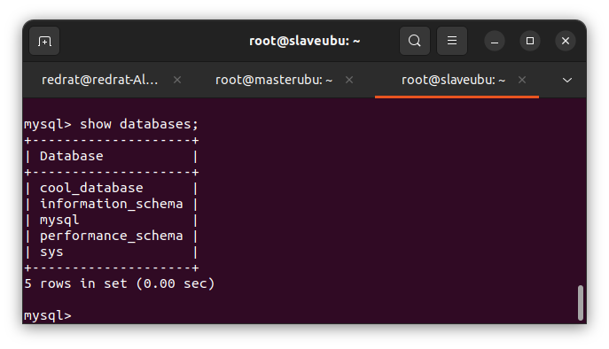

# Домашнее задание к занятию "Репликация и масштабирование. Часть 1" - Пешева Ирина

### Задание 1

На лекции рассматривались режимы репликации master-slave, master-master, опишите их различия.

*Ответить в свободной форме.*

### Решение 1

#### master-slave

Один узел – master, остальные – slaves. 
Информация попадает в master, после чего сразу или через некоторое время вычитывается подчинёнными узлами.

При этом запись может происходить только в master, из slave доступно только чтение.

#### master-master

Все узлы – master.

Запись может осуществляться во все из них, а изменения вычитываются другими master'ами.

#### Итого

Основное различие – количество доступных для записи узлов. В случае master-slave, запись ведётся только на один узел и затем расходится по read-only подчинённым. В случае master-master все узлы доступны для чтения-записи и обмениваются информацией о внесённых изменениях.

---
### Задание 2

Выполните конфигурацию master-slave репликации, примером можно пользоваться из лекции.

*Приложите скриншоты конфигурации, выполнения работы: состояния и режимы работы серверов.*

### Решение 2

#### Master

my.cfg:

status:

#### Slave

my.cfg

status

База данных, созданная на мастере, отображается на слейве:

---

## Дополнительные задания (со звездочкой*)

Эти задания дополнительные (не обязательные к выполнению) и никак не повлияют на получение вами зачета по этому домашнему заданию. Вы можете их выполнить, если хотите глубже и/или шире разобраться в материале.

### Задание 3

Выполните конфигурацию master-master репликации. Произведите проверку.

*Приложите скриншоты конфигурации, выполнения работы: состояния и режимы работы серверов.*

### Решение 3

#### Master 1 (masterubu)

my.cnf

Slave status:

Master status:

#### Master 2 (slaveubu)

my.cnf

Slave status:

Master status:

#### Тестирование

Изменения на одной машине влияют на другую и наоборот:

