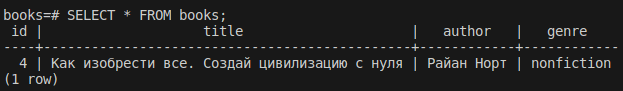
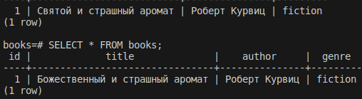

# Домашнее задание к занятию "Репликация и масштабирование. Часть 2" - Пешева Ирина

### Задание 1

Опишите основные преимущества использования масштабирования методами:

- активный master-сервер и пассивный репликационный slave-сервер; 
- master-сервер и несколько slave-серверов;
- активный сервер со специальным механизмом репликации — distributed replicated block device (DRBD);
- SAN-кластер.

*Дайте ответ в свободной форме.*

### Решение 1

#### Master-slave, где есть 1 slave

* Реализована репликация.
* В базовом виде представлено резервирование.
* При выходе из строя одной ноды не нарушается доступность данных; другая нода может взять на себя обязанности вышедшей из строя.
* Большая нагрузка при чтении перенесена на slave.

#### Master-slave, где есть много slave

* То же, что и master-slave с одной slave-нодой, но лучше (хотя и затратнее).
    * Лучше распределение нагрузки.
    * Лучше отказоустойчивость.
* Можно реализовать партицирование или шардинг, в зависимости от потребностей.

#### DRBD

* Позволяет копировать дублировать данные с локального хранилища на удалённое без особых настроек.
* Не то, чтобы масштабирование, но резервное копирование.
* Реализован на уровне ядра Linux как модуль.
* Приложения ничего не знают о том, что данные реплицируются.
    * Получается, реализация не так сильно зависит от используемого решения.

#### SAN-кластер

* Позволяет создать сеть устройств, нагрузку на которые распределит самостоятельно.
* Может хранить огромные объёмы данных.
* Для устройств выглядит как обычный примонтированный диск.
* Надёжность как основной принцип.

---
### Задание 2

Разработайте план для выполнения горизонтального и вертикального шардинга базы данных. База данных состоит из трёх таблиц: 

- пользователи, 
- книги, 
- магазины (столбцы произвольно). 

Опишите принципы построения системы и их разграничение или разбивку между базами данных.

*Пришлите блоксхему, где и что будет располагаться. Опишите, в каких режимах будут работать сервера.* 

### Решение 2

Предположим, таблицы содержат следующие данные:

users:
* id
* login
* username
* gender

books:
* id
* title
* author
* genre

shop:
* id
* name
* city

Каких-то связей между ними провести через foreign key не получится, так как все связи между книгами, пользователями и магазинами можно описать только через отношения many-to-many.

Для вертикального шардинга разобьём базу данных на три, по одной на каждую таблицу:

У нас будут три инстанса, на каждом по базе данных (users, books, stores); на каждой будут содержаться одноимённые таблицы, по одной на каждую БД.

Для горизонтального шардинга каждую БД можно разбить ещё на несколько по какому-либо признаку. Например:
* книги будут разделены по жанру;
* магазины будут разбиты по городу;
* пользователи будут самым осуждаемым образом разделены по половому признаку.

Тогда:

Разбиение по жанрам получилось чрезвычайно условным, да и сеть наша раскинулась всего на два города, но что уж поделать.

В указанных БД структура таблиц будет повторять друг друга.

Сами БД находятся на разных инстансах и, по сути, друг от друга не зависят. Сведение данных в одну таблицу полностью лежит на приложении, которое будет работать с такой базой данных.

Либо ещё есть вариант, когда есть один общий сервер, который содержит все таблицы, которые по определённым правилам заполняют и вычитывают данные из наследующих таблиц, находящихся на других серверах. Тогда:

---

## Дополнительные задания (со звездочкой*)

Эти задания дополнительные (не обязательные к выполнению) и никак не повлияют на получение вами зачета по этому домашнему заданию. Вы можете их выполнить, если хотите глубже и/или шире разобраться в материале.

### Задание 3

Выполните настройку выбранных методов шардинга из задания 2.

*Пришлите конфиг Docker и SQL скрипт с командами для базы данных*.

### Решение 3

В честно найденном в интернете решении используется PostgreSQL и его расширение postgres_fdw. Его вариант нашёлся и для MySQL, но его ещё нужно устанавливать отдельно. Так что было решено использовать PostgreSQL.

Решение следующее:

Для таблицы, которую мы планируем разделять, создаются таблицы на удалённых серверах, где указывается ограничение, по которому мы и их и делим. Тут ничего нового.

Далее для этих таблиц на исходном сервере создаются FOREIGN таблицы, ссылающиеся на таблицы на удалённых серверах.

Эти FOREIGN таблицы объединяются через VIEW. Для этой VIEW настраиваются правила, по которым в неё (а точнее в её исходники) будут добавляться, удаляться и обновляться данные. Последнее -- самое страшное, так как нужно ещё предусмотреть удаление из одной таблицы и перенос в другую, если меняется ключевое значение, по которому делились таблицы.

Всё это помогает создать видимость единой таблицы при том, что на самом деле таблица хранится по частям на удалённых нодах. Однако мороки при этом столько, что невольно закрадывается подозрение, что это как-то можно сделать проще. Это же никаких стажёров не напасёшься менять структуру таких таблиц.

Однако же, что сделано, то сделано. Проверяем (на примере работы с books подробнее, для остальных таблиц только в основной БД, так как настройка везде по сути одна).

[docker-compose.yml](12.7.3/docker-compose.yml)

[SQL-команды](12.7.3/bookshops.sql)

#### INSERT

Bookshops:

Books_fiction:

Books_nonfiction:

#### DELETE

Bookshops:

Books_fiction:

Books_nonfiction:

#### UPDATE

##### Изменить название

Bookshops:

Books_fiction:

Books_nonfiction:

##### Изменить жанр

#### Беглая проверка таблицы users

#### Беглая проверка таблицы stores

