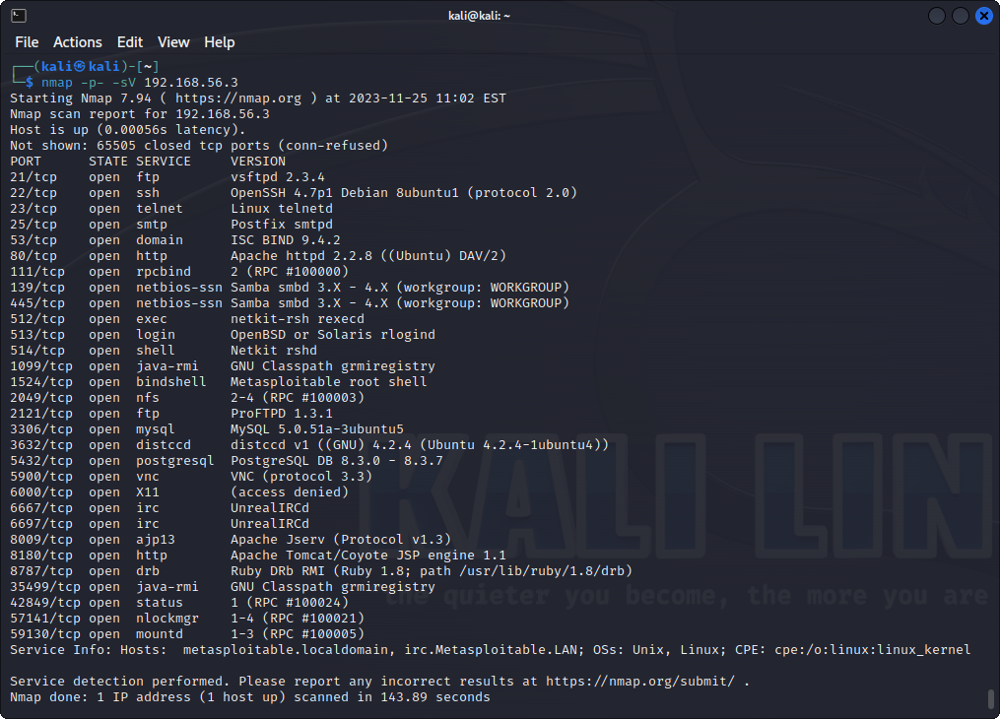
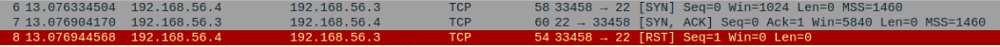
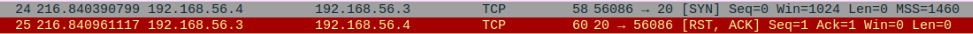
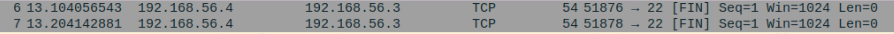
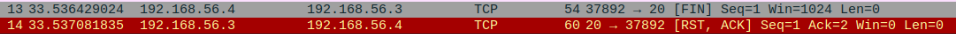
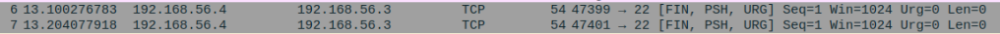
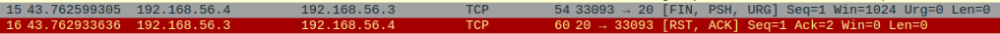
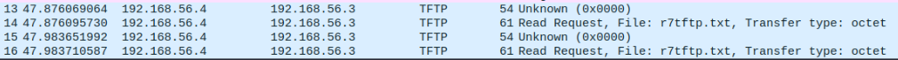
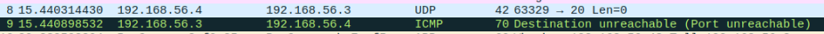

# Домашнее задание к занятию "Уязвимости и атаки на информационные системы" - Пешева Ирина


### Задание 1

Скачайте и установите виртуальную машину Metasploitable: https://sourceforge.net/projects/metasploitable/.

Это типовая ОС для экспериментов в области информационной безопасности, с которой следует начать при анализе уязвимостей.

Просканируйте эту виртуальную машину, используя **nmap**.

Попробуйте найти уязвимости, которым подвержена эта виртуальная машина.

Сами уязвимости можно поискать на сайте https://www.exploit-db.com/.

Для этого нужно в поиске ввести название сетевой службы, обнаруженной на атакуемой машине, и выбрать подходящие по версии уязвимости.

Ответьте на следующие вопросы:

- Какие сетевые службы в ней разрешены?
- Какие уязвимости были вами обнаружены? (список со ссылками: достаточно трёх уязвимостей)
  
*Приведите ответ в свободной форме.*  

### Решение 1

#### Службы

С помощью nmap можно обнаружить 23 порта, которые прослушивают OpenSSH, telnet, Apache, PostgreSQL, MySQL и кто только не.



#### Уязвимости

* [MySQL 5.1.23 - Server InnoDB CONVERT_SEARCH_MODE_TO_INNOBASE Function Denial of Service ](https://www.exploit-db.com/exploits/30744) – работает для MySQL 5.1.23 и ранее.<br>
Вызывает "отказ в обслуживании" за счёт ввода определённых данных.
* [PostgreSQL 8.3.6 - Conversion Encoding Remote Denial of Service](https://www.exploit-db.com/exploits/32849)<br>
Смена кодировки, из-за которой происходит разрыв соединений.
* [ProFTPd 1.3 - 'mod_sql' 'Username' SQL Injection](https://www.exploit-db.com/exploits/32798) – актуально для 1.3.1-1.3.2. <br>
SQL-инъекция.

---
### Задание 2

Проведите сканирование Metasploitable в режимах SYN, FIN, Xmas, UDP.

Запишите сеансы сканирования в Wireshark.

Ответьте на следующие вопросы:

- Чем отличаются эти режимы сканирования с точки зрения сетевого трафика?
- Как отвечает сервер?

*Приведите ответ в свободной форме.*

### Решение 2

#### SYN

```console
nmap -sS <ip>
```
По протоколу TCP отправляется пакет с флагом ACK. 

Если что-то прослушивает порт, возвращается пакет с флагом SYN. Тогда для завершения отправляется пакет с RST.



Может прийти пакет с RST, ACK – тогда порт в списке открытых не отобразится.




#### FIN

```console
nmap -sA <ip>
```

По протоколу TCP отправляет пакет с флагом FIN.

Если никто не отвечает, отображает информацию по порту.



Если пришёл ответ, порт в список не добавляется.



#### Xmas

```console
nmap -sX <ip>
```

Ситуация примерно та же, что с FIN, только отпавляются три флага: FIN, PSH и URG:





#### UDP

```console
nmap -sU <ip>
```

Отличие этого метода можно обнаружить и без Wireshark – он медленный. Зато Wireshark помогает понять, почему – пакеты отправляются неколько раз. Другое заметное отличие – использование другого протокола и различие в виде запроса для некоторых портов:




Порты помечаются как открытые (но фильтрующие), если после нескольких попыток ответ не пришёл.

При получении ICMP ответа о недостижимости порт считается закрытым.

