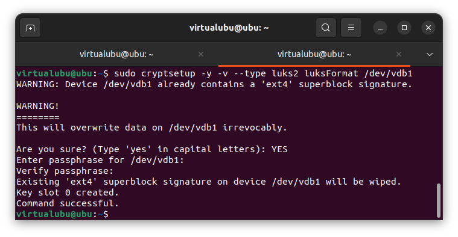

# Домашнее задание к занятию "Защита хоста" - Пешева Ирина

### Задание 1

1. Установите **eCryptfs**.
2. Добавьте пользователя cryptouser.
3. Зашифруйте домашний каталог пользователя с помощью eCryptfs.

*В качестве ответа  пришлите снимки экрана домашнего каталога пользователя с исходными и зашифрованными данными.*  

### Решение 1

---
### Задание 2

1. Установите поддержку **LUKS**.
2. Создайте небольшой раздел, например, 100 Мб.
3. Зашифруйте созданный раздел с помощью LUKS.

*В качестве ответа пришлите снимки экрана с поэтапным выполнением задания.*

### Решение 2

Создадим раздел vdb1.

Зашифруем его:

Открываем раздел LUKS'ом:

Начинаем работу с разделом – добавляем файловую систему и монтируем, куда нам надо.

Раздел зашифрован, примонтирован и готов к работе.

По завершении работ отмонтируем и закрываем.

---

## Дополнительные задания (со звездочкой*)

Эти задания дополнительные (не обязательные к выполнению) и никак не повлияют на получение вами зачета по этому домашнему заданию. Вы можете их выполнить, если хотите глубже и/или шире разобраться в материале.

### Задание 3

1. Установите **apparmor**.
2. Повторите эксперимент, указанный в лекции.
3. Отключите (удалите) apparmor.

*В качестве ответа пришлите снимки экрана с поэтапным выполнением задания.*

### Решение 3

Устанавливаем и проверяем apparmor:

Далее:
* заменяем man на ping;
* добавляем apparmor в режим обучения;
* запускаем "man";
* переводим apparmor в боевой режим:
* запускаем "man".

В первом случае ping прошёл, во втором его уже не пропустили.

Останавливаем apparmor, выгружаем профили и выпускаем наш жутко вредоносный ping на свободу.

