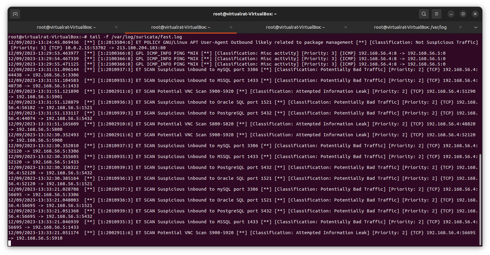
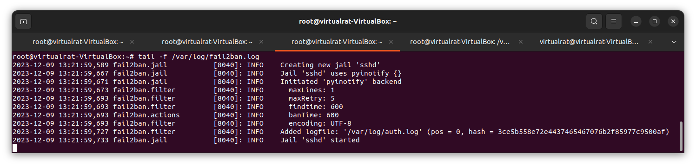
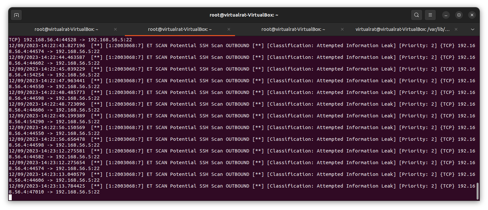
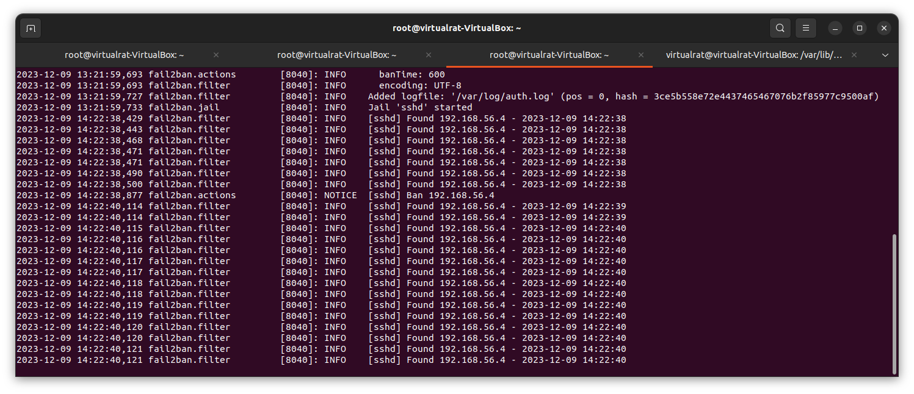
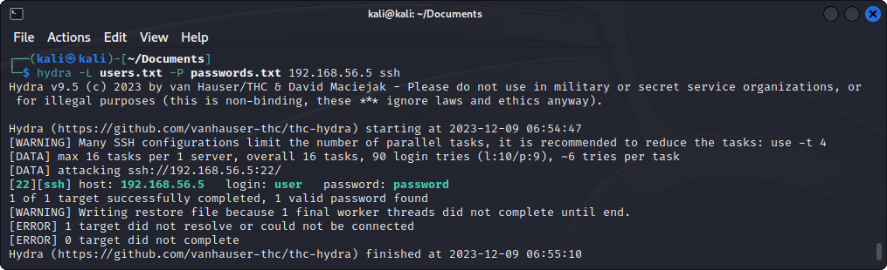

# Домашнее задание к занятию "Защита сети" - Пешева Ирина

### Задание 1

Проведите разведку системы и определите, какие сетевые службы запущены на защищаемой системе:

**sudo nmap -sA < ip-адрес >**

**sudo nmap -sT < ip-адрес >**

**sudo nmap -sS < ip-адрес >**

**sudo nmap -sV < ip-адрес >**

По желанию можете поэкспериментировать с опциями: https://nmap.org/man/ru/man-briefoptions.html.

*В качестве ответа пришлите события, которые попали в логи Suricata и Fail2Ban, прокомментируйте результат.*

### Решение 1

#### nmap

nmap на Kali ничего особо не обнаружил, кроме порта ssh и того, что хост вообще работает.

#### Suricata

12/09/2023-13:24 – обращение хоста ещё до сканирования nmap. 

Ничего подозрительного.

12/09/2023-13:29 – сканирование nmap с опцией -sA (агрессивное сканирование). Определён протокол ICMP. 

Всё ещё ничего подозрительного.

12/09/2023-13:31 – сканирование nmap с опцией -sT (TCP connect-сканирование).

12/09/2023-13:32 – сканирование nmap с опцией -sS (TCP SYN-сканирование).

12/09/2023-13:33 – сканирование nmap с опцией -sV (сканирование с определением версий).

Все три сканирования определены как потенциальные/подозрительные попытки сканирования с применением протокола TCP и уровенем приоритета 2 ("преднаивысший"). В общем, ведёт себя 192.168.56.4 как-то подозрительно.

#### Fail2ban

Fail2ban эти попытки особо не заинтересовали:

---
### Задание 2

Проведите атаку на подбор пароля для службы SSH:

**hydra -L users.txt -P pass.txt < ip-адрес > ssh**

1. Настройка **hydra**: 
 
 - создайте два файла: **users.txt** и **pass.txt**;
 - в каждой строчке первого файла должны быть имена пользователей, второго — пароли. В нашем случае это могут быть случайные строки, но ради эксперимента можете добавить имя и пароль существующего пользователя.

Дополнительная информация по **hydra**: https://kali.tools/?p=1847.

2. Включение защиты SSH для Fail2Ban:

-  открыть файл /etc/fail2ban/jail.conf,
-  найти секцию **ssh**,
-  установить **enabled**  в **true**.

Дополнительная информация по **Fail2Ban**:https://putty.org.ru/articles/fail2ban-ssh.html.

*В качестве ответа пришлите события, которые попали в логи Suricata и Fail2Ban, прокомментируйте результат.*

### Решение 2

Атака была проведена в 12/09/2023-14:23 и видна в обоих файлах логов.

#### Suricata

Suricata без проблем увидела в этом всём сканирование SSH.

#### Fail2ban

Fail2ban посмотрел на это, зафиксировал да и забанил.

Без Fail2ban пароль ожидаемо подбирается.

